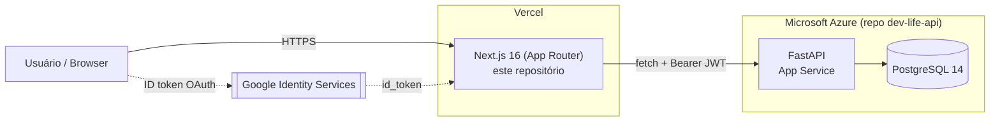

# Dev Life: Frontend

Interface web (Next.js) do sistema de produtividade **Dev Life**, consumindo a API real em produção. Este README documenta a arquitetura e a engenharia por trás do frontend para quem está avaliando o projeto como portfólio de **Cloud/DevOps Jr**. O backend, a infraestrutura Azure e a mensageria estão detalhados no repositório da API: [`dev-life-api`](https://github.com/Gabriel24701/dev-life-api).

[](https://github.com/Gabriel24701/dev-life-web/actions/workflows/ci.yml)

---

## 1. Onde este repositório entra na arquitetura



Detalhes de CI/CD do backend, Terraform, worker assíncrono e observabilidade estão no README da API; aqui o foco é o que roda neste repositório.

| Camada | Tecnologia |
|---|---|
| Framework | Next.js 16 (App Router) |
| UI | React 19 + Tailwind CSS |
| Ícones | Lucide React |
| Estado | Context API (`AuthContext`, `TasksContext`, `HabitsContext`, `ToastContext`) |
| HTTP | `fetch` nativo, centralizado em `src/services/api.ts` |
| Tipagem | TypeScript strict |
| Testes | Vitest + Testing Library + jsdom |
| Deploy | Vercel (integração nativa com o GitHub) |

---

## 2. CI

`.github/workflows/ci.yml`, disparado em **pull requests para `dev`/`main`**:

```
npm ci → tsc --noEmit → vitest run --coverage (43 testes) → eslint → SonarCloud
```

Não há step de deploy neste workflow: o deploy para produção é feito pela integração nativa da Vercel com o GitHub (build automático a cada push/merge para a branch de produção), fora do GitHub Actions. Este pipeline existe para bloquear merge de código que não compila (`type-check`), quebra testes, ou falha no lint, **antes** de qualquer deploy acontecer.

---

## 3. Testes

**43 testes em 9 arquivos** (Vitest + `@testing-library/react`, ambiente `jsdom`):

| Arquivo | Testes |
|---|---|
| `src/contexts/TasksContext.test.tsx` | 10 |
| `src/contexts/HabitsContext.test.tsx` | 10 |
| `src/app/dashboard/settings/page.test.tsx` | 6 |
| `src/app/dashboard/tasks/TasksPage.filters.test.tsx` | 4 |
| `src/components/tasks/TaskFormModal.test.tsx` | 4 |
| `src/app/auth/login/page.test.tsx` | 3 |
| `src/components/habits/HabitFormModal.test.tsx` | 3 |
| `src/contexts/AuthContext.test.tsx` | 2 |
| `tests/smoke.test.ts` | 1 |

**Filosofia**: `src/services/api.ts` é mockado via `vi.mock` em todos os testes de Context/componente: nenhum teste faz uma chamada de rede real contra a API. Isso isola o comportamento de estado (loading, erro, optimistic update, rollback) do comportamento real do backend, que é coberto pelos 58 testes do repositório `dev-life-api`. Cobertura é gerada com `@vitest/coverage-v8` (`lcov.info`) e reportada ao SonarCloud junto com type-check e lint.

---

## 4. Segurança (o que cabe ao frontend)

- **Autenticação real** contra a API: `/auth/login`, `/auth/register`, `/auth/me`, sem mock, sem dado fake.
- **Login com Google** via [Google Identity Services](https://developers.google.com/identity/gsi/web) (`NEXT_PUBLIC_GOOGLE_CLIENT_ID`); o backend faz a validação real do `id_token` (ver README da API, seção 8).
- Token JWT e usuário ficam em `localStorage` (`devlife:token` / `devlife:user`); toda chamada autenticada em `src/services/api.ts` injeta `Authorization: Bearer <token>` automaticamente.
- Sem essa variável configurada, o botão do Google simplesmente não é renderizado: falha silenciosa e segura, login por senha continua funcionando.

---

## Estrutura de arquivos

```
src/
├── app/
│   ├── layout.tsx                          # Root layout + prevenção de flash de tema
│   ├── page.tsx                            # Landing page (/)
│   ├── auth/
│   │   ├── login/page.tsx (+ .test.tsx)
│   │   └── register/page.tsx
│   └── dashboard/
│       ├── layout.tsx                      # Auth guard + shell
│       ├── page.tsx
│       ├── settings/page.tsx (+ .test.tsx)
│       └── tasks/page.tsx (+ TasksPage.filters.test.tsx)
│
├── components/
│   ├── ui/            Button, Input, Modal, ThemeToggle
│   ├── layout/         Sidebar, DashboardHeader
│   ├── dashboard/      StatCard
│   ├── auth/           GoogleSignInButton
│   ├── tasks/          TaskList, TaskItem, TaskFormModal (+ .test.tsx)
│   └── habits/         HabitFormModal (+ .test.tsx)
│
├── contexts/
│   ├── AuthContext.tsx (+ .test.tsx)
│   ├── TasksContext.tsx (+ .test.tsx)
│   ├── HabitsContext.tsx (+ .test.tsx)
│   └── ToastContext.tsx
│
├── services/
│   └── api.ts          # cliente HTTP único → authService / tasksService / habitsService
│
└── types/
    └── index.ts
```

---

## Rodando localmente

```bash
npm install
npm run dev             # http://localhost:3000
```

| Variável | Obrigatória | Descrição |
|---|---|---|
| `NEXT_PUBLIC_API_URL` | Não | Sem ela, aponta para `http://localhost:8000`. |
| `NEXT_PUBLIC_GOOGLE_CLIENT_ID` | Só para login Google | Deve ser **o mesmo** Client ID configurado como `GOOGLE_CLIENT_ID` no backend. |

```bash
# na raiz do monorepo local (docker-compose.yml do dev-life-api)
docker compose up   # sobe API + frontend juntos
```
